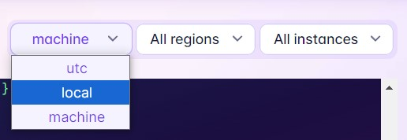

# fly Live Logs Time Formatter

## Installation
1. Go to [extensions](chrome://extensions/)
2. Click "Load unpacked"
3. Select the project folder
4. Go to your app's Live Logs dashboard and select an option

## Options
1. utc - the default timestamp
2. local - the browser's timestamp
3. machine - the machine region's timestamp
